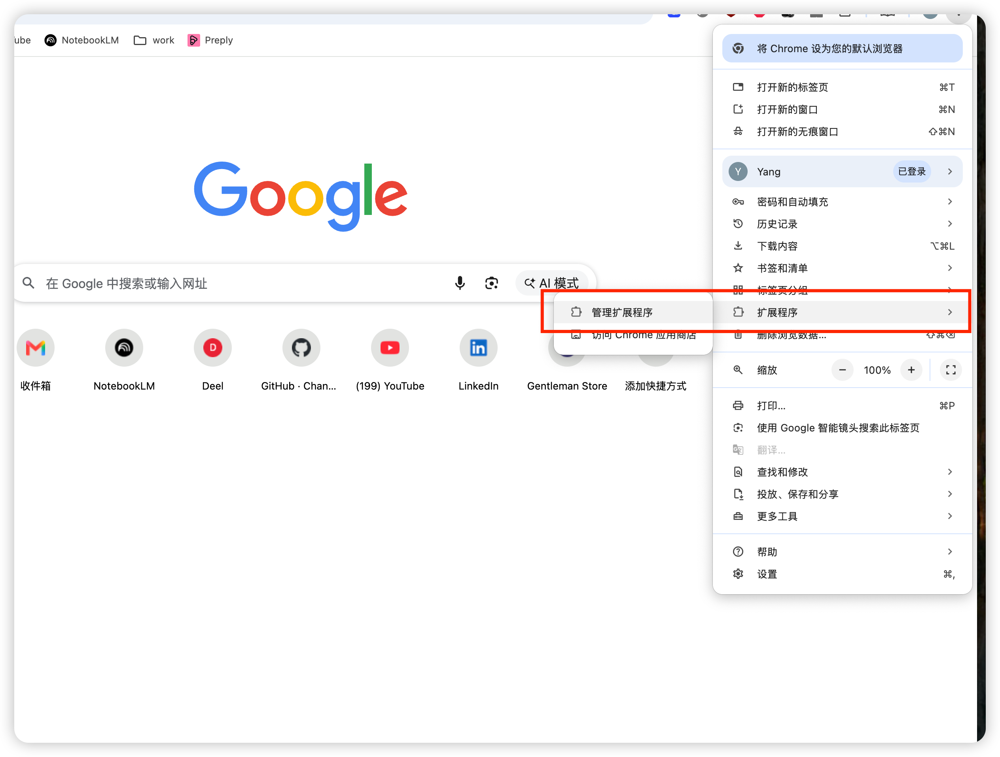
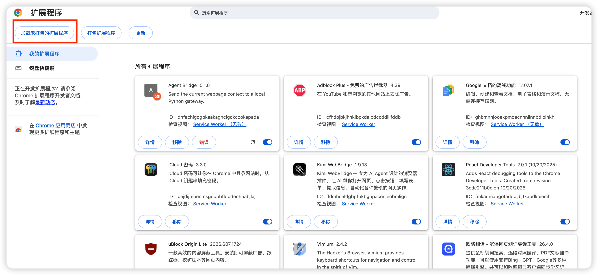
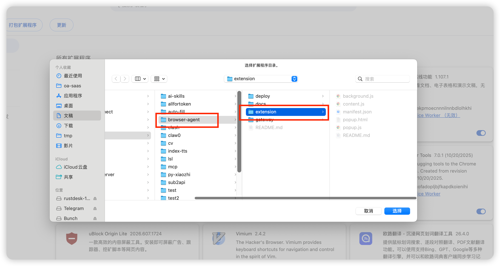
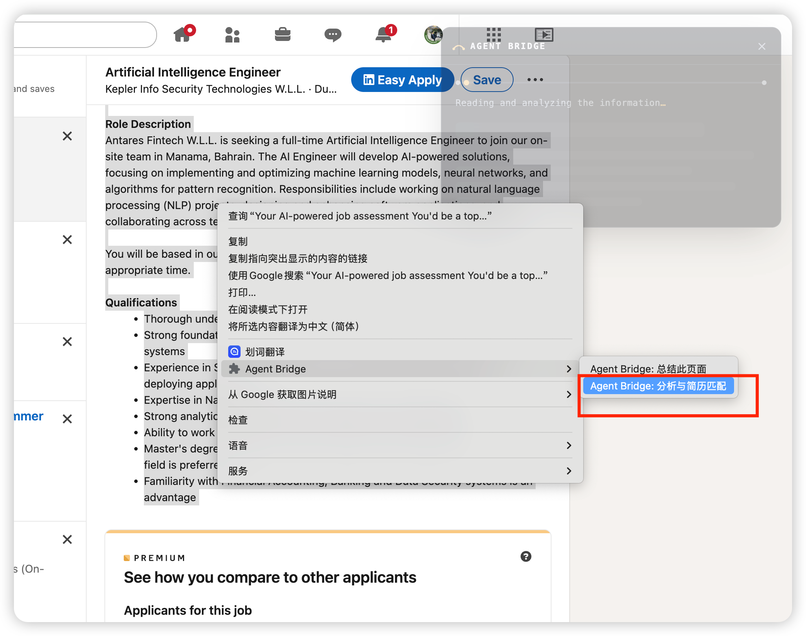
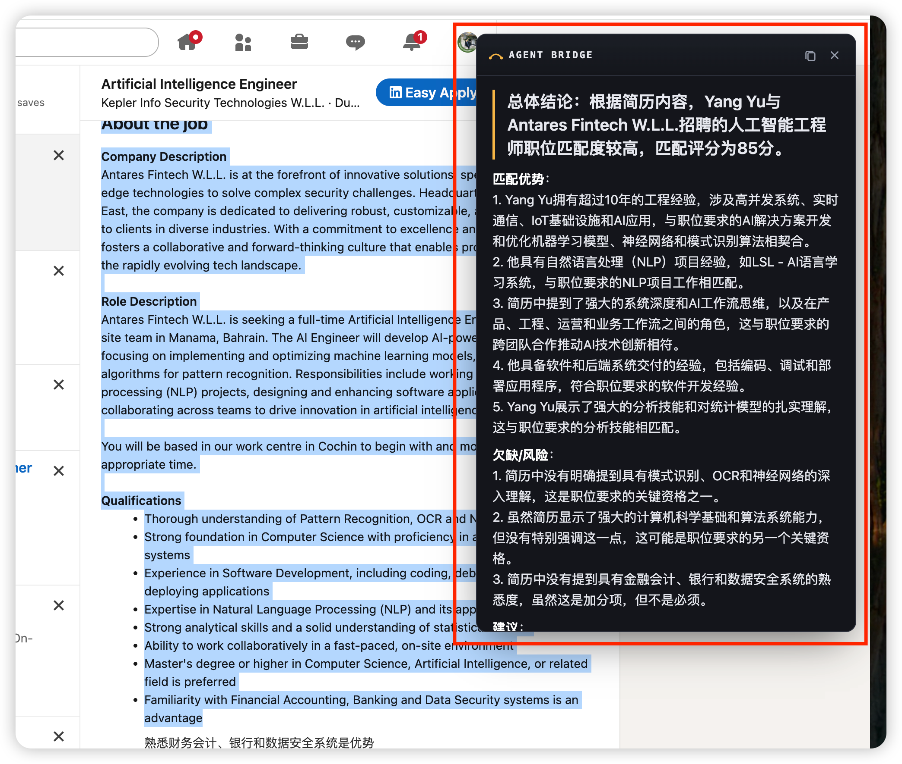

# Agent Bridge 安装说明

整个安装分两步:先配置并启动本地 Gateway,再在 Chrome 中加载扩展。

## 前置条件

- Chrome 浏览器
- [uv](https://docs.astral.sh/uv/)(Python 包管理器,用于运行 Gateway)
- 一个 OpenAI 或任意 OpenAI 兼容服务的 API Key(Moonshot / 豆包 / DeepSeek / 本地 Ollama 均可)

## 第一步:配置环境变量

进入 `gateway` 目录,复制示例配置并填入真实值:

```bash
cd gateway
cp .env.example .env
```

编辑 `.env` 文件,各变量含义如下:

| 变量 | 必填 | 说明 |
| --- | --- | --- |
| `OPENAI_API_KEY` | ✅ | OpenAI 或任意 OpenAI 兼容服务的 API Key |
| `OPENAI_BASE_URL` | | 接口地址,留空使用 OpenAI 官方地址。示例:`https://api.moonshot.ai/v1`(Moonshot / Kimi)、`https://ark.cn-beijing.volces.com/api/v3`(火山方舟 / 豆包)、`https://api.deepseek.com/v1`(DeepSeek)、`http://localhost:11434/v1`(本地 Ollama) |
| `AGENT_BRIDGE_MODEL` | | 模型 id,短输入使用,要快要省。默认 `gpt-4o-mini`,例:`moonshot-v1-8k` |
| `AGENT_BRIDGE_MODEL_LONG` | | 长输入路由:prompt 超过阈值字符数时改用该模型,让大页面 / 简历匹配也能装下。留空则不路由,所有任务统一用 `AGENT_BRIDGE_MODEL`。例:`moonshot-v1-128k` |
| `AGENT_BRIDGE_ROUTE_THRESHOLD` | | 长输入阈值,单位是**字符**,默认 `6000`。中文约 1 字符 = 1 token,英文约 4 字符 = 1 token,中文偏多时阈值要设低 |
| `AGENT_BRIDGE_CV_PATH` | | 简历文件路径(职位匹配 Agent 使用),默认 `data/cv/cv.pdf`(相对 `gateway` 目录) |

> 注意:`.env` 包含密钥,不要提交到 git。真实环境变量优先于 `.env` 文件中的值,所以也可以不用 `.env`,直接 `export OPENAI_API_KEY=sk-...`。

一个使用 Moonshot 的完整示例:

```bash
OPENAI_API_KEY=sk-...
OPENAI_BASE_URL=https://api.moonshot.ai/v1
AGENT_BRIDGE_MODEL=moonshot-v1-8k
AGENT_BRIDGE_MODEL_LONG=moonshot-v1-128k
AGENT_BRIDGE_ROUTE_THRESHOLD=6000
```

## 第二步:启动 Gateway

```bash
cd gateway
uv run uvicorn app.main:app --host 127.0.0.1 --port 17321
```

扩展固定访问 `http://127.0.0.1:17321`,端口不要改。

## 第三步:在 Chrome 中安装扩展

### 1. 打开扩展程序管理页

点击 Chrome 右上角菜单 → 扩展程序 → 管理扩展程序(或直接在地址栏输入 `chrome://extensions`):



### 2. 加载未打包的扩展程序

先打开右上角的「开发者模式」开关,然后点击左上角的「加载未打包的扩展程序」:



### 3. 选择 extension 目录

在弹出的文件选择框中,选择本项目下的 `extension` 目录:



安装完成后,扩展列表中会出现 **Agent Bridge**。

> 加载未打包的扩展是持久的,Chrome 重启后依然存在,不需要重复安装。如果更新了扩展源码,到 `chrome://extensions` 点一下 Agent Bridge 卡片上的刷新按钮(⟳)即可生效。

## 使用方法

1. 打开任意网页(需要的话先选中一段文字)
2. 右键 → 在 **Agent Bridge** 子菜单中选择一个动作,例如「总结此页面」或「分析与简历匹配」:



3. 页面右侧会弹出 Agent Bridge 浮层面板,显示分析结果。以 LinkedIn 职位页为例,「分析与简历匹配」会给出总体结论、匹配评分、匹配优势、欠缺/风险和建议:



## 常见问题

- **右键发送后没有反应 / 报错**:确认 Gateway 已启动,且监听在 `127.0.0.1:17321`。
- **返回模型调用错误**:检查 `.env` 中的 `OPENAI_API_KEY` 和 `OPENAI_BASE_URL` 是否正确,模型 id 是否是该服务商支持的。
- **大页面 / 长文本失败**:配置 `AGENT_BRIDGE_MODEL_LONG` 为长上下文模型,必要时调低 `AGENT_BRIDGE_ROUTE_THRESHOLD`。
